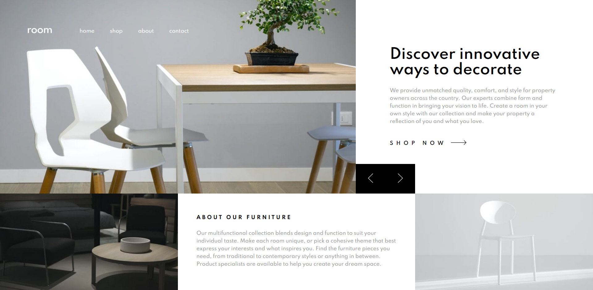

# Frontend Mentor - Room homepage solution

This is a solution to the [Room homepage challenge on Frontend Mentor](https://www.frontendmentor.io/challenges/room-homepage-BtdBY_ENq). Frontend Mentor challenges help you improve your coding skills by building realistic projects.

## Table of contents

- [Overview](#overview)
  - [The challenge](#the-challenge)
  - [Screenshot](#screenshot)
  - [Links](#links)
- [My process](#my-process)
  - [Built with](#built-with)
- [Author](#author)

## Overview

### The challenge

Users should be able to:

- View the optimal layout for the site depending on their device's screen size
- See hover states for all interactive elements on the page
- Navigate the slider using keyboard

### Screenshot

### Links

- Solution URL: [Link](https://www.frontendmentor.io/solutions/responsive-room-homepage-challenge-hub-using-css-grid-TYp5oEEgT)
- Live Site URL: [Live](https://roomhomepage-dngtnv.netlify.app/)

## My process

### Built with

- Semantic HTML5 markup
- SCSS
- CSS Grid
- JS

## Author

- Frontend Mentor - [@dngtnv](https://www.frontendmentor.io/profile/dngtnv)
