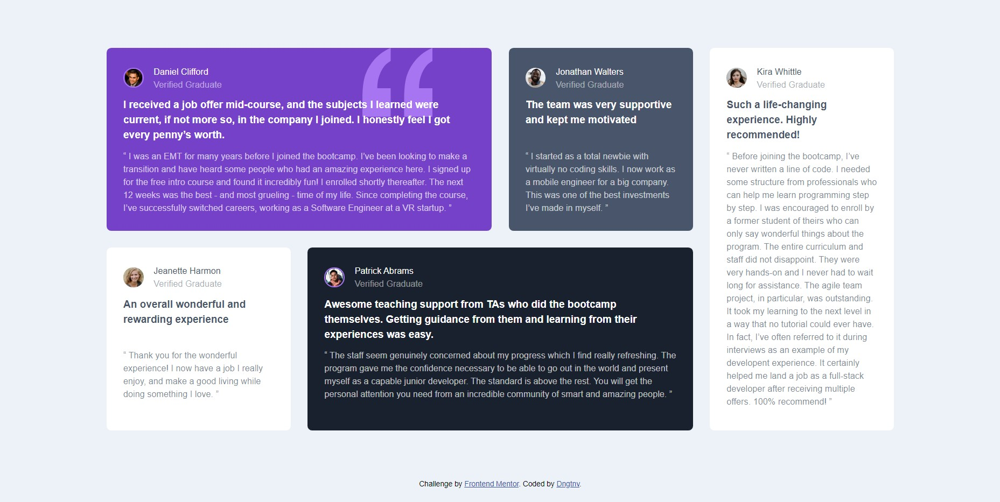

# Frontend Mentor - Testimonials grid section solution

This is a solution to the [Testimonials grid section challenge on Frontend Mentor](https://www.frontendmentor.io/challenges/testimonials-grid-section-Nnw6J7Un7). Frontend Mentor challenges help you improve your coding skills by building realistic projects.

## Table of contents

- [Overview](#overview)
  - [The challenge](#the-challenge)
  - [Screenshot](#screenshot)
  - [Links](#links)
- [My process](#my-process)
  - [Built with](#built-with)
- [Author](#author)

## Overview

### The challenge

Users should be able to:

- View the optimal layout for the site depending on their device's screen size

### Screenshot

### Links

- Solution URL: [Solution](https://www.frontendmentor.io/solutions/testimonials-grid-section-using-css-grid-and-scss-JmmkB8Oiu)
- Live Site URL: [Live](https://testimonials-cssgrid-challenge.vercel.app/)

## My process

### Built with

- Semantic HTML5 markup
- SCSS
- Flexbox
- CSS Grid

## Author

- Frontend Mentor - [@dngtnv](https://www.frontendmentor.io/profile/dngtnv)
