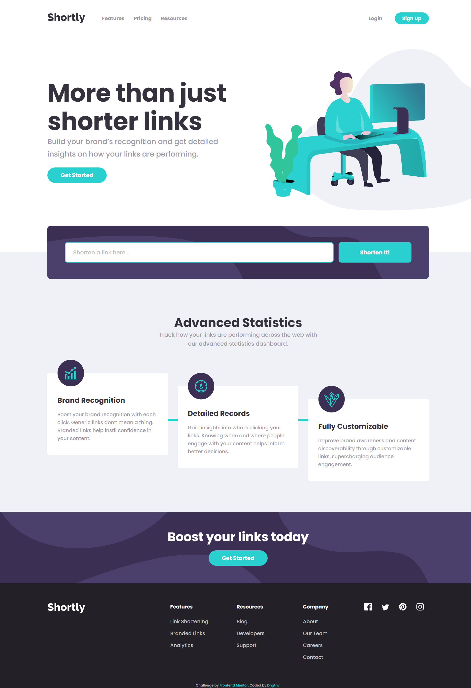

# Frontend Mentor - Shortly URL shortening API Challenge solution

This is a solution to the [Shortly URL shortening API Challenge challenge on Frontend Mentor](https://www.frontendmentor.io/challenges/url-shortening-api-landing-page-2ce3ob-G). Frontend Mentor challenges help you improve your coding skills by building realistic projects.

## Table of contents

- [Overview](#overview)
  - [The challenge](#the-challenge)
  - [Screenshot](#screenshot)
  - [Installation and Setup](#installation)
  - [Links](#links)
- [My process](#my-process)
  - [Built with](#built-with)
  - [What I learned](#what-i-learned)
- [Author](#author)

## Overview

### The challenge

Users should be able to:

- View the optimal layout for the site depending on their device's screen size
- Shorten any valid URL
- See a list of their shortened links, even after refreshing the browser
- Copy the shortened link to their clipboard in a single click
- Receive an error message when the `form` is submitted if:
  - The `input` field is empty

### Screenshot



### Installation

#### Example:

- Clone this repository. You will need node and npm installed globally on your machine.

Installation:

`npm install`

To Run Test Suite:

`npm test`

To Start Server:

`npm start`
Open [http://localhost:3000](http://localhost:3000) to view it in the browser.

### Links

- Solution URL: [Link](https://your-solution-url.com)
- Live Site URL: [Live](https://your-live-site-url.com)

## My process

### Built with

- Semantic HTML5 markup
- SCSS
- Flexbox
- Mobile-first workflow
- [React](https://reactjs.org/) - JS library

### What I learned

#### Clipboard.writeText()

The Clipboard interface's writeText() property writes the specified text string to the system clipboard. Text may be read back using either read() or readText().

```js
var promise = navigator.clipboard.writeText(newClipText);
```

## Author

- Frontend Mentor - [@dngtnv](https://www.frontendmentor.io/profile/dngtnv)
